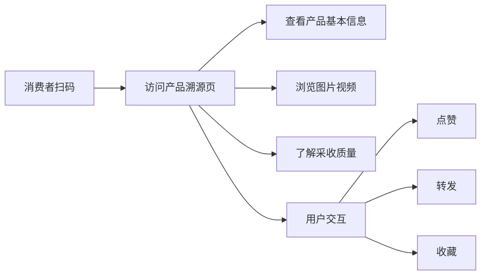

## 1. 产品概述
农产品二维码溯源系统，通过扫码访问产品详情页，展示农产品全流程信息并提供用户交互功能。
- 目标：为消费者提供透明的农产品溯源信息，增强产品可信度
- 价值：提升农产品品牌形象，建立消费者信任

## 2. 核心功能

### 2.1 用户角色
| 角色 | 注册方式 | 核心权限 |
|------|---------|---------|
| 消费者 | 无需注册 | 浏览产品信息、点赞、转发、收藏 |

### 2.2 功能模块
1. **产品溯源页**：产品基本信息、图片视频、采收质量、用户交互
2. **二维码生成器**（管理端）：为产品生成专属二维码
3. **防刷机制**：限制短时间内同一IP/设备的频繁操作

### 2.3 页面详情
| 页面名称 | 模块名称 | 功能描述 |
|---------|---------|---------|
| 产品溯源页 | 产品基本信息 | 展示品种名、定植地点、定植时间，支持品种编码映射 |
| 产品溯源页 | 图片视频展示 | 轮播或网格展示产品图片和视频 |
| 产品溯源页 | 采收质量信息 | 展示采收时间、糖度、重量、口感、适应人群、品质小结 |
| 产品溯源页 | 用户交互区 | 点赞、转发、收藏功能，无需登录 |

## 3. 核心流程

## 4. 用户界面设计

### 4.1 设计风格
- **主色调**：自然绿色系（#4CAF50）和大地色系（#8D6E63）
- **辅助色**：温暖橙色（#FF9800）
- **按钮风格**：圆角矩形，带轻微阴影
- **字体**：现代无衬线字体，层级清晰
- **布局风格**：卡片式，垂直滚动
- **图标风格**：简洁线条图标

### 4.2 页面设计概述
| 页面名称 | 模块名称 | UI元素 |
|---------|---------|--------|
| 产品溯源页 | 产品基本信息 | 大标题、信息卡片、渐变背景 |
| 产品溯源页 | 图片视频展示 | 轮播组件、缩略图网格 |
| 产品溯源页 | 采收质量信息 | 数据指标卡片、品质小结文本框 |
| 产品溯源页 | 用户交互区 | 固定底部操作栏、动画反馈 |

### 4.3 响应式设计
- 移动端优先，自适应各种屏幕尺寸
- 触控优化，按钮和可点击区域大小合适
