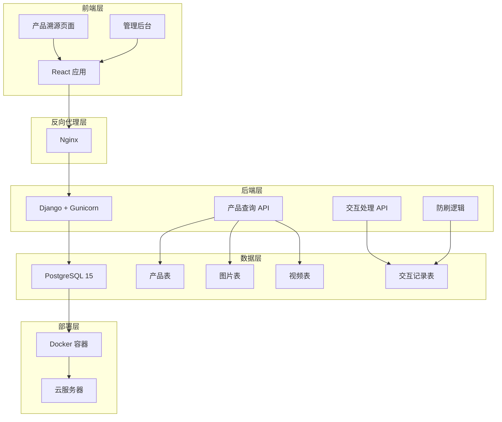
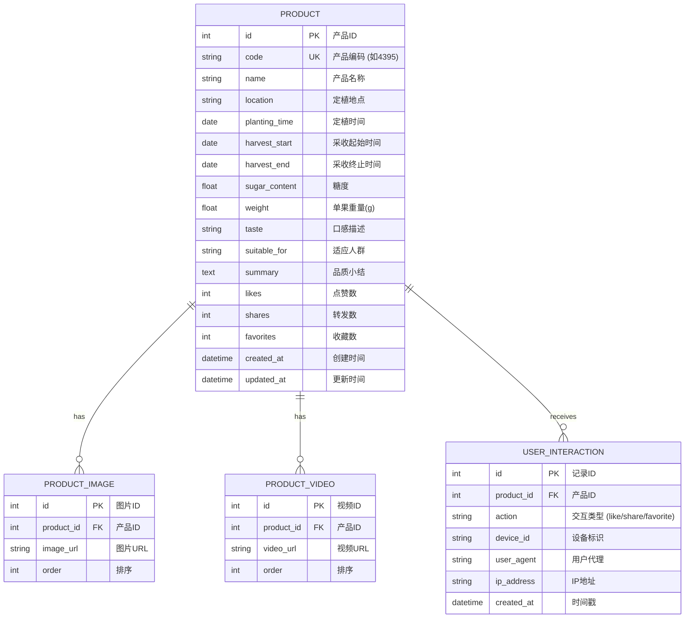

## 1. 架构设计


## 2. 技术栈
- **前端**：React@18 + TypeScript + Tailwind CSS + Vite + React Router 7
- **后端**：Django 6.0.4 + Django REST Framework + Gunicorn
- **数据库**：PostgreSQL 15
- **反向代理**：Nginx
- **部署**：Docker + Docker Compose
- **二维码**：qrcode.react
- **图标**：lucide-react

## 3. 路由定义
| 路由 | 用途 |
|-----|------|
| / | 首页 |
| /product/:productCode | 产品溯源页面，根据产品编码展示信息 |
| /admin | 管理后台 |

### 后端 API 路由
| 接口 | 方法 | 说明 |
|------|------|------|
| /api/products/ | GET | 获取产品列表 |
| /api/products/{code}/ | GET | 获取产品详情 |
| /api/interactions/ | POST | 提交用户交互（点赞/分享/收藏） |

## 4. 数据模型

### 4.1 数据模型定义


### 4.2 Django 模型

```python
# backend/products/models.py
from django.db import models

class Product(models.Model):
    """产品模型"""
    code = models.CharField(max_length=20, unique=True, verbose_name="产品编码")
    name = models.CharField(max_length=100, verbose_name="产品名称")
    location = models.CharField(max_length=200, verbose_name="定植地点")
    planting_time = models.DateField(verbose_name="定植时间")
    harvest_start = models.DateField(verbose_name="采收开始时间")
    harvest_end = models.DateField(verbose_name="采收结束时间")
    sugar_content = models.FloatField(verbose_name="糖度")
    weight = models.FloatField(verbose_name="单果重量(g)")
    taste = models.CharField(max_length=100, verbose_name="口感描述")
    suitable_for = models.CharField(max_length=200, verbose_name="适应人群")
    summary = models.TextField(verbose_name="品质小结")
    likes = models.IntegerField(default=0, verbose_name="点赞数")
    shares = models.IntegerField(default=0, verbose_name="分享数")
    favorites = models.IntegerField(default=0, verbose_name="收藏数")
    created_at = models.DateTimeField(auto_now_add=True, verbose_name="创建时间")
    updated_at = models.DateTimeField(auto_now=True, verbose_name="更新时间")

class ProductImage(models.Model):
    """产品图片模型"""
    product = models.ForeignKey(Product, related_name="images", on_delete=models.CASCADE)
    image_url = models.URLField(max_length=500, verbose_name="图片URL")
    order = models.IntegerField(default=0, verbose_name="排序")

class ProductVideo(models.Model):
    """产品视频模型"""
    product = models.ForeignKey(Product, related_name="videos", on_delete=models.CASCADE)
    video_url = models.URLField(max_length=500, verbose_name="视频URL")
    order = models.IntegerField(default=0, verbose_name="排序")

class UserInteraction(models.Model):
    """用户交互模型（防刷）"""
    product = models.ForeignKey(Product, on_delete=models.CASCADE)
    action = models.CharField(max_length=20, choices=[
        ('like', '点赞'),
        ('share', '分享'),
        ('favorite', '收藏')
    ])
    device_id = models.CharField(max_length=100, verbose_name="设备ID")
    user_agent = models.CharField(max_length=500, verbose_name="用户代理")
    ip_address = models.CharField(max_length=50, verbose_name="IP地址")
    created_at = models.DateTimeField(auto_now_add=True, verbose_name="操作时间")
    
    class Meta:
        unique_together = ['product', 'action', 'device_id']  # 防止同一设备重复操作
```

## 5. 防刷机制设计
1. **设备指纹**：使用 localStorage 存储设备标识
2. **数据库唯一约束**：同一设备对同一产品的同一操作只能执行一次
3. **IP 记录**：记录每次操作的 IP 地址，便于后续分析
4. **前端频率限制**：防止频繁点击

## 6. Docker 配置
- **应用容器**：多阶段构建（node:20-alpine + python:3.11-slim）
- **数据库容器**：postgres:15-alpine
- **反向代理**：nginx:alpine
- **暴露端口**：80（HTTP），内部 8000（Django）
