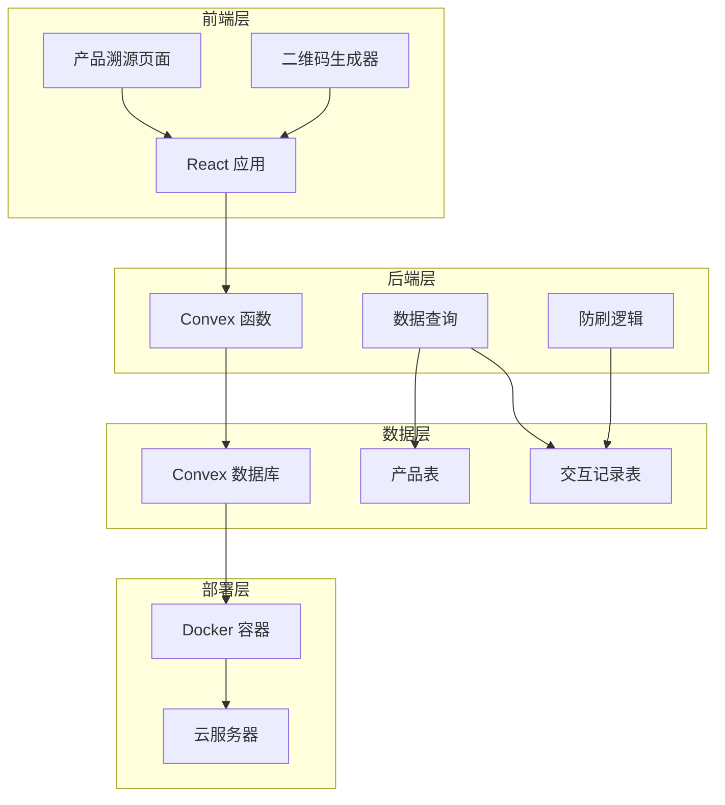
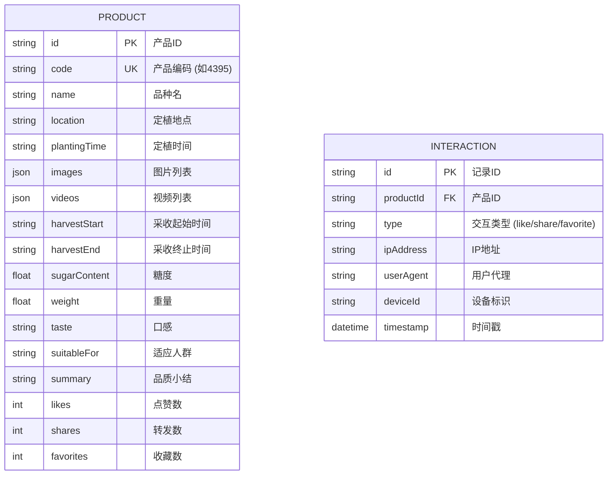

## 1. 架构设计


## 2. 技术栈
- **前端**：React@18 + TypeScript + Tailwind CSS + Vite
- **后端**：Convex（Serverless Backend）
- **数据库**：Convex Database
- **部署**：Docker + 云服务器
- **二维码**：qrcode.react
- **图标**：lucide-react

## 3. 路由定义
| 路由 | 用途 |
|-----|------|
| /product/:productCode | 产品溯源页面，根据产品编码展示信息 |
| /admin/qrcode | 二维码生成管理页面（可选） |

## 4. 数据模型

### 4.1 数据模型定义


### 4.2 Convex Schema
```typescript
// convex/schema.ts
import { defineSchema, defineTable } from "convex/server";
import { v } from "convex/values";

export default defineSchema({
  products: defineTable({
    code: v.string(),
    name: v.string(),
    location: v.string(),
    plantingTime: v.string(),
    images: v.array(v.string()),
    videos: v.array(v.string()),
    harvestStart: v.string(),
    harvestEnd: v.string(),
    sugarContent: v.number(),
    weight: v.number(),
    taste: v.string(),
    suitableFor: v.string(),
    summary: v.string(),
    likes: v.number(),
    shares: v.number(),
    favorites: v.number(),
  }).index("by_code", ["code"]),

  interactions: defineTable({
    productId: v.id("products"),
    type: v.union(v.literal("like"), v.literal("share"), v.literal("favorite")),
    ipAddress: v.string(),
    userAgent: v.string(),
    deviceId: v.string(),
    timestamp: v.number(),
  }).index("by_product_and_type", ["productId", "type"]),
});
```

## 5. 防刷机制设计
1. **IP限制**：同一IP在5分钟内最多点赞/收藏3次
2. **设备指纹**：使用localStorage存储设备标识
3. **时间窗口**：记录每次操作时间，限制频率
4. **数据库验证**：后端查询验证操作合法性

## 6. Docker 配置
- 基础镜像：node:20-alpine
- 多阶段构建：构建层 + 运行层
- 暴露端口：前端 5173，Convex 本地开发端口
